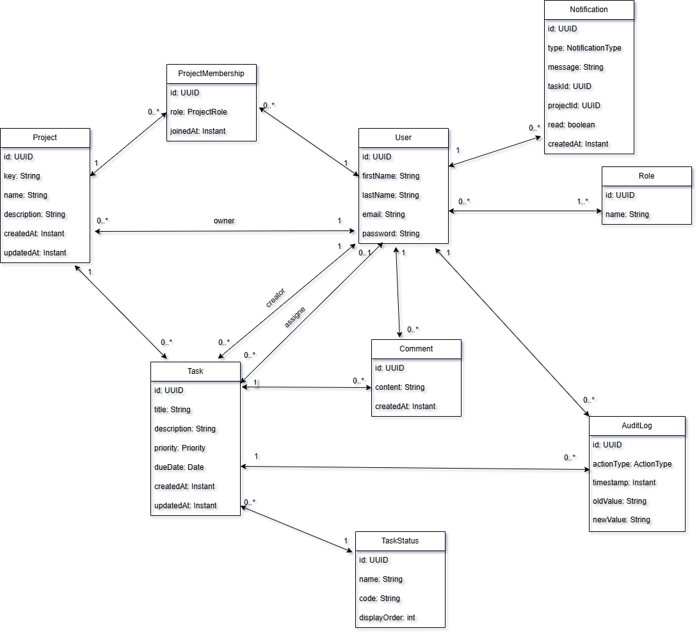

# Task Management System


Task Management System is a web application designed to support task tracking and workflow management within a software development team.  

This project is developed as part of the *Advanced Software Technologies* course and is designed to be extensible for further academic work.


---

## Class Diagram

📌 Domain Model Overview (Task Management System)

This domain model represents a simple Task Management System (JIRA-like). The main entities are:

Project – represents a project that contains tasks

User – system users (can be a project owner, task creator, assignee, etc.)

Task – a work item that belongs to a project

Comment – discussion/comments related to a task

AuditLog – history of changes for activity tracking

Role – system-wide roles (e.g., ADMIN, USER)

ProjectMembership – association between User and Project, including a project-specific role

TaskStatus – task statuses (e.g., TODO, IN_PROGRESS, DONE)



## Database (Docker)

This project uses **PostgreSQL**. To start the database locally using Docker Compose:

```bash
docker compose up -d
```

To stop and remove containers:
```bash
docker compose down
```

---

## Technologies

### Backend

- Java 21

- Spring Boot 4

- Spring Data JPA

- PostgreSQL

- Spring Security (JWT Authentication)

- OpenApi 3


### Frontend

TODO

### Testing

TODO

---

## License

Copyright © 2026 Božidar Mastilović


